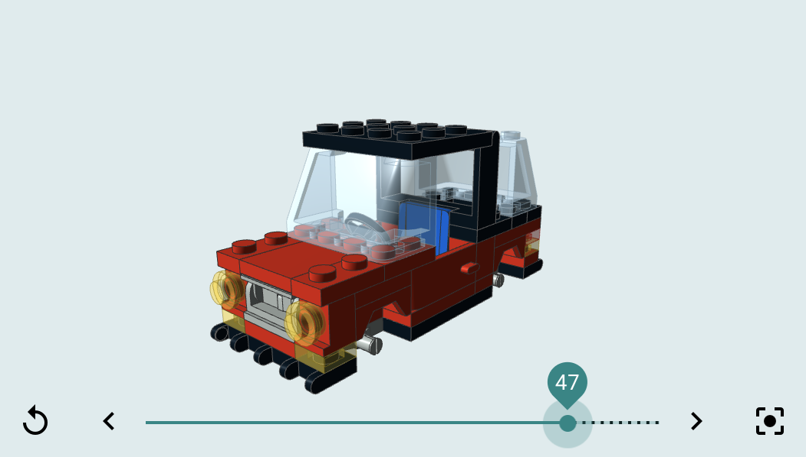

# &lt;brick-viewer&gt;

A web component for viewing models built with a certain type of plastic brick!

```html
<brick-viewer src="car.mpd"></brick-viewer>
```



## Attributes

| Name                | Type             | Default     | Description
| ------------------- | ---------------- | ----------- | -----------
| `src`               | `string`         | `""`        | A `.mpd` URL. The model at this URL is fetched and displayed.
| `step`              | `number`         | `undefined` | The number of steps to display. The model will be partially displayed if this number is less than the total number of steps in the model.
